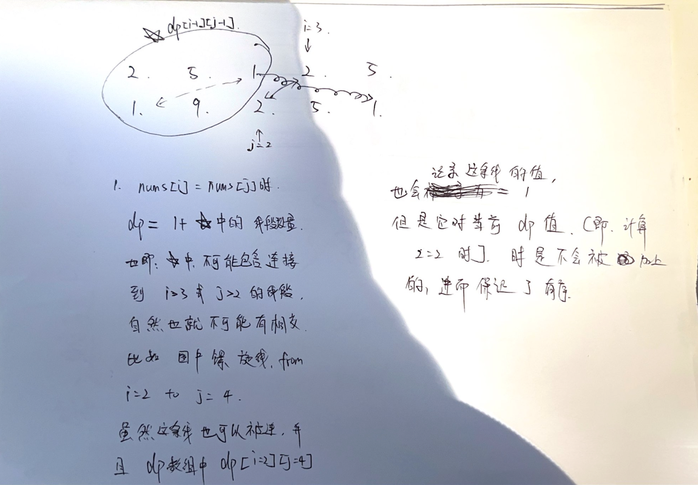

为什么 L300 这道题， 与L718 两道题， 所找的子序列都是不连续的， 但是L718 的dp 可以直接记录 0-i 与 0-j 之间重复序列的最大值，直接返回dp[-1][-1]。
 但是 L300不行？ -> 因为 L300 中， 对于nums[i], 以他结尾的最长升序自数组 的长度， 不能简单依赖于 以nums[i-1]结尾的最大自数组长度。

显然， 对于 nums = [1, 3, 2, 5] -> 如果 定义 dp[i] 为在数组 nums 的前 i 个元素中的最长递增子序列的长度 （"不一定以 nums[i] 结尾"）

dp[0] = 1 （只有一个元素 1）
dp[1] = 2 （递增子序列为 [1, 3]）
dp[2] = 2 （递增子序列为 [1, 3]，在 0-2 范围内）
dp[3] = 3 （递增子序列为 [1, 3, 5]）
但现在，注意到当我们在计算 dp[3] 时，我们不能直接使用 dp[2] 的值，因为以索引 2 结尾的最长递增子序列不是 [1, 3]，而是 [1, 2]。所以，当我们需要计算 dp[3] 时，我们无法利用 dp[2] 的信息来进行有效的计算，因为它并没有告诉我们以索引 2 结尾的最长递增子序列的信息。

这就是为什么在 L300 中，定义 dp[i] 为以 nums[i] 结尾的最长递增子序列的长度是有意义的。这样的定义允许我们在计算每个状态时，有效地利用之前的状态。

但是对于L718， 我们则没有这样的问题。

# 为什么 对于 L1035, L 718 这种 不连续子序列的题 元素间顺序

先看 L1035：
这道题引发了一个思考， 即， 以下代码是怎么保证 "线不想交的"？ 即对于这种问题而言， 他是怎么保证 所找出的 子数组 之中的元素相对顺序
与 原数组 之中元素的相对顺序是不变的？
关键就在于， 他在比较相等的时候， "只比较了 t1, t2 两个当前指针指向的数。 并且 t1, t2 相等的情况下，dp[i][j] 是基于 dp[i-1][j-1] 计算的"。
这代表什么？ 代表以下画面： 
